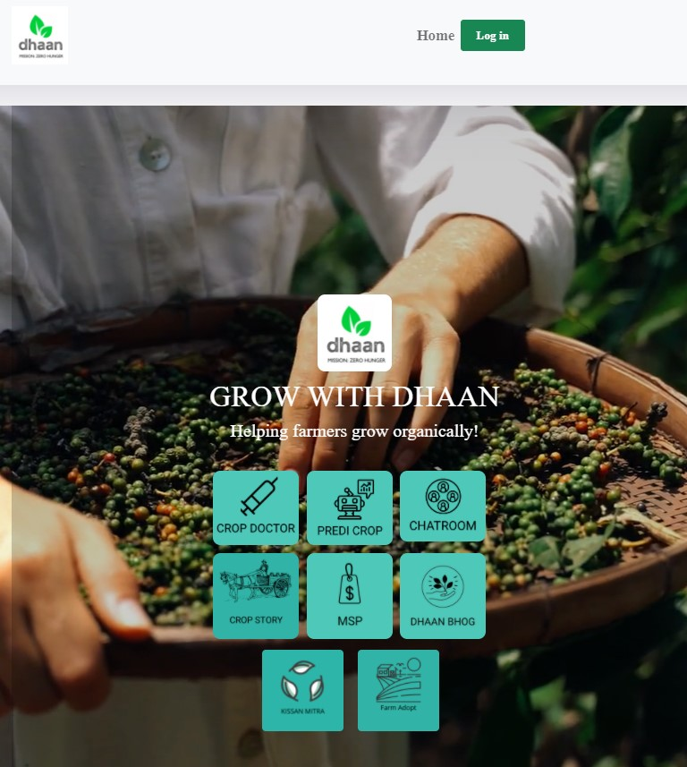

# Welcome to DHAAN
## Mission: ZERO Hunger! Organically!

  ## Contents

1. [Short description](#short-description)
1. [Demo video](#demo-video)
1. [The architecture](#the-architecture)
1. [Long description](#long-description)
1. [Project roadmap](#project-roadmap)
1. [Live demo](#live-demo)
1. [Built with](#built-with)
1. [Future Tech inclusion](#future-tech-inclusion)
1. [Team](#team)
1. [License](#license)
1. [Acknowledgments](#acknowledgments)

## Short description
Connecting – FARMERS, COOPs and Consumers organically for mission Zero Hunger
### What's the problem?
As per UN, there are about 821 million people estimated to be chronically undernourished and over 90 million children under five are dangerously underweight. This affects all the living being of our planet by creating scarity of food and leading hunger, mal nourishment etc.

### How can technology help?

**Dhaan** – inspired from Sanskrit (“_grain_”) and from Hindi ( “_to donate_”) **– connects – FARMERS, COOPs and Consumers for mission Zero Hunger.** – we plan to use technology for helping the farmers to produce organic food produce, connecting coops to farmers effectively and enabling the general public to get access to **nutritious and organically grown food**. 

Moreover we will be enabling the public to donate excess food that they have there by bringing in a balance in the ecosystem which is one step closer to our mission - **Zero Hunger**.

The AI infused Web app is holistically developed which is in alignment with UN’s SDG goal of *ending all forms of hunger and malnutrition by 2030*, making sure all people have sufficient and nutritious food all year. 

### The idea

It's imperative that enabling access to healthy and nourished food is the crux of a food chain.  With DHAAN, we are providing a set of tools, backed by IBM Cloud and Watson Services, that will empower Farmers, Cooperative societies and the general public to stay connected in a single place and evolve together.

## Demo video

## The architecture

1. The user navigates to the web app and provides the inputs:
		a. Region
		b. Sowing Time
		c. Soil Type (optional)
2. The inputs are fed into the **prediCrop AI Engine** which will analyse the inputs using the AI algorithm built with IBM Auto AI
3. Output is given to the user in **regional text (IBM Translate)** as well as with option to listen in **regional language (IBM Text to Speech)**

## Long description
**Key Modules of DHAAN:**
1.	Farmer 
2.	CoOps 
3.	Consumer 
4.	Kissan Mitra
5.	Farm Adopt

**Farmers module:**
Goals:
	To help farmer get him / her self-educated on organic practices there by enabling to produce nutritious rich crops; 
	To identify diseases in crops
Features:
	•	Crop Doctor - AI enabled Plant disease identifier
	•	PrediCrop - AI enabled Crop recommender
	•	Text to Text Language Translation
	•	Text to Speech conversion
	•	Infused with IBM Auto AI
	•	Collaborative chat room

Intended user: Farmer
*********************************************************
**CoOps module:**
•	Goals:
	•	To bring in transparency by showing which mandi(s) is / are closer to the farmer
	•	The crops that are being accepted in a particular mandi
	•	The number of slots / capacity available in a mandi so that the farmer can book a slot for himself and can go
	•	Sharing of MSP (Minimum Support Price) publicly
	•	Eliminating middle persons / broker
Features:
	•	Slot booking 
	•	MSP display
	•	Farmer schemes display
	•	Collaborative chat room

Intended user(s): Farmer & CoOps admin
*********************************************************
**Consumer module:**
	Goals:
**My Ccrop Story** (Demonstrative UI flow implemented): 
•	To see the history of the produce (from the farm to the fork) they are buying from a store there by supporting the mission of “ending mal nutrition”
•	Will be using computer vision, QR code, block chain technology
**DHAAN BHOG** (Demonstrative flow implemented):
•	The user can share the excess food available with them by putting it up in the DHAANBHOG store - a market place to donate perishable food items there by supporting the Zero Hunger mission
Flow:
    •	User puts up an item in the store for donation along with qualScore 
    •	qualScore - a star rating system (from One star to Five stars):
    •	Determined based on factors like:
    •	Date of purchase of the item
    •	Condition of the item which will be analyzed using computer vision and combination of AI / ML algorithms using IBM Auto AI
    •	Gets connected to an NGO
    •	Both parties agree on a pickup location / drop point (available from within the app)
    •	Once the items gets exchanged (i.e. from DONOR to NGO), dCoins (short form for DHAAN coin) will be added to the donor wallet which he / her can use to redeem to buy environmentally sustainable products
•	Collaborative chat room (Implemented)
*********************************************************
**Kissan mitra** (Demonstrative UI flow implemented):
Goal: To connect farmers to general public as a friend
Features:
•	General public can become "*friends*" of the farmers by connecting with them "*socially*"
•	Both can share their experiences and learn from each other
•	Intended user: General public
*********************************************************
**Farm Adopt** (Demonstrative UI flow implemented):
Goal: General public can support the cause of farmers by adopting a farm and help the farmer to grow the produce organically
•	Intended user: General public

## Project roadmap

## Live demo 
https://dhaanui.herokuapp.com/

## Built with

## Future Tech inclusion

## Team
- **Bharathi Athinarayanan** - _AI / ML  Architect & Team Lead_ 
- **Baji Jinka** - _Senior Front End UI / UX Developer_
- **Prashanth P** - _Senior Full Stack Developer_
- **Purushothaman Srikanth** - _UX / Data Engineering_
- **Raghavendra K** - _Deployment Support Engineer_ 
## License
This project is licensed under the Apache 2 License - see the [LICENSE](LICENSE) file for details.
## Acknowledgments
- Ms. Rema - Agri expert ( http://www.isdindia.org/)
