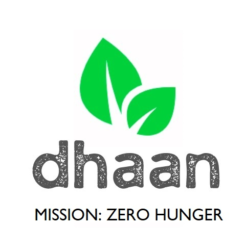
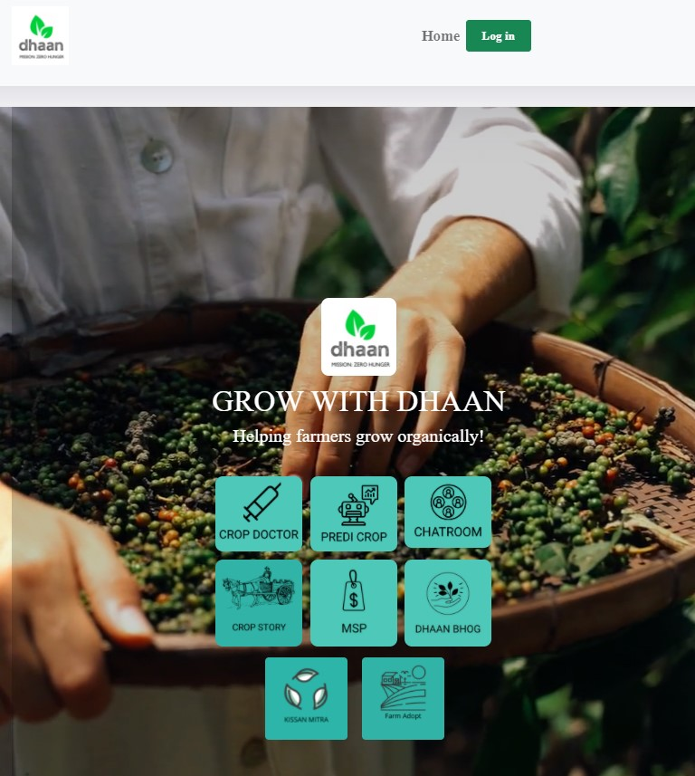
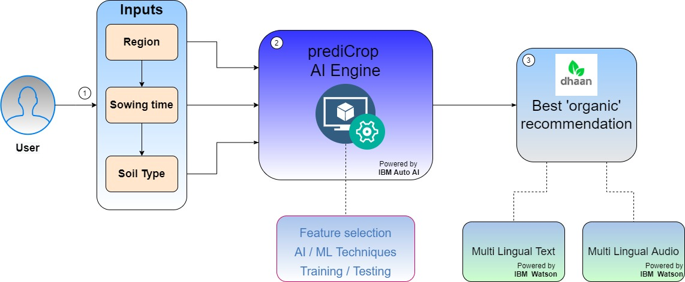
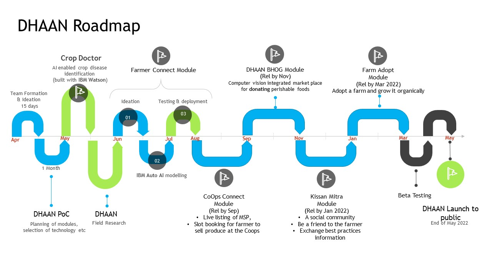
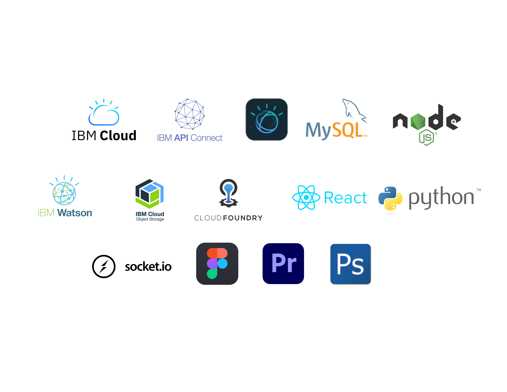
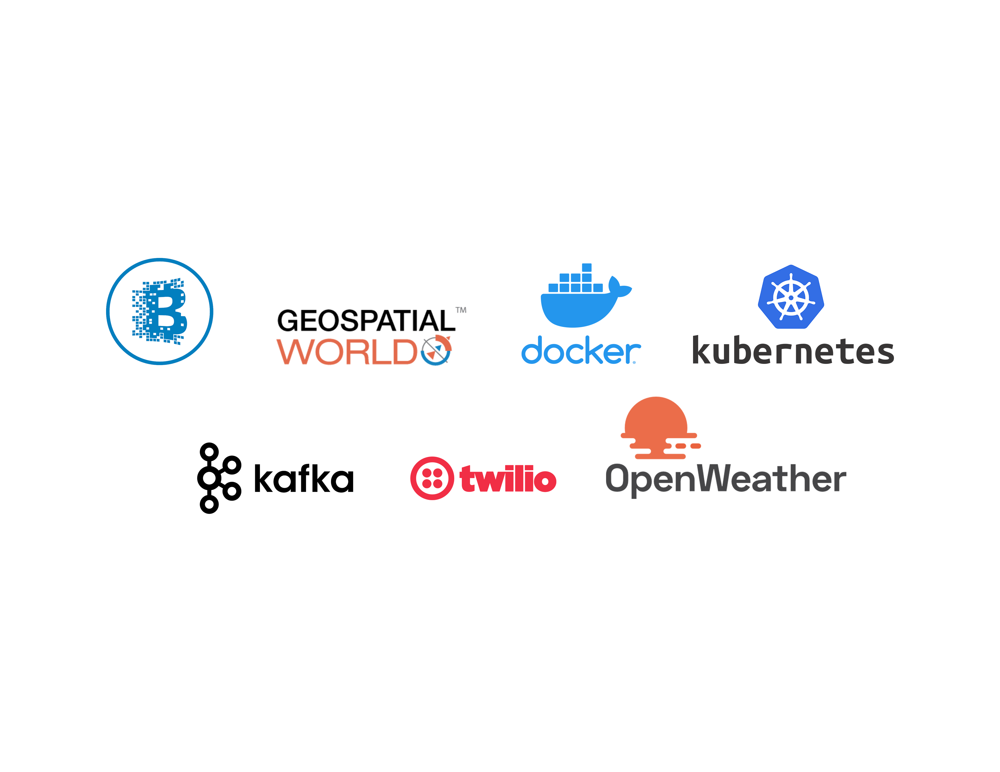

# Welcome to DHAAN
## Mission: ZERO Hunger! Organically!
[](https://www.apache.org/licenses/LICENSE-2.0)
  ## Contents

1. [Short description](#short-description)
1. [Demo video](#demo-video)
1. [The architecture](#architecture-overview)
1. [Long description](#long-description)
1. [Project roadmap](#project-roadmap)
1. [Live demo](#live-demo)
1. [Built with](#built-with)
1. [Future Tech inclusion](#future-tech-inclusion)
1. [Team](#team)
1. [License](#license)
1. [Acknowledgments](#acknowledgments)

## Short description
Connecting – FARMERS, COOPs and Consumers organically for mission Zero Hunger
### What's the problem?
As per UN, there are about 821 million people estimated to be chronically undernourished and over 90 million children under five are dangerously underweight. This affects all the living being of our planet by creating scarity of food and leading hunger, mal nourishment etc.

### How can technology help?

**Dhaan** – inspired from Sanskrit (“_grain_”) and from Hindi ( “_to donate_”) **– connects – FARMERS, COOPs and Consumers for mission Zero Hunger.** – we plan to use technology for helping the farmers to produce organic food, connecting coops to farmers effectively and enabling the general public to get access to **nutritious and organically grown food**. 

Moreover we will be enabling the public to donate excess food that they have there by bringing in a balance in the ecosystem which is one step closer to our mission - **Zero Hunger**.

The AI infused Web app is holistically developed which is in alignment with UN’s SDG goal of *ending all forms of hunger and malnutrition by 2030*, making sure all people have sufficient and nutritious food all year. 

### The idea

It's imperative that enabling access to healthy and nourished food is the crux of a food chain.  With DHAAN, we are providing a set of tools, backed by IBM Cloud and Watson Services, that will empower Farmers, Cooperative societies and the general public to stay connected in a single place and evolve together.

IBM Cloud :</br>
- IBM Watson Studio
- IBM Cloud Storage
- IBM Text to Speech 
- IBM Language Translator
- IBM Auto AI
- IBM Watson Studio
- IBM Cloud Storage
- IBM Cloud Foundry


## Demo video

[]

Demo video link: https://drive.google.com/file/d/1FUX4S7MVy_cxwYCmowpVX4RHBgs4gM3-/view?usp=sharing

## Architecture Overview




1. The user navigates to the web app and provides the inputs: </br>
		a. Region </br>
		b. Sowing Time </br>
		c. Soil Type (optional) </br>
2. The inputs are fed into the **prediCrop AI Engine** which will analyse the inputs using the AI algorithm built with IBM Auto AI </br>
3. Output is given to the user in **regional text (IBM Translate)** as well as with option to listen in **regional language (IBM Text to Speech)**

## Long description
**Key Modules of DHAAN:**
1.	Farmer 
2.	Co-Operative Societies 
3.	Consumer
4.	Donations
5.	Kissan Mitra
6.	Farm Adopt
	

**Farmers module:** </br>
	Goals: </br>
-	To help farmer getting him / her self-educated on organic practices there by enabling to produce nutritious rich crops; 
-	To identify diseases in crops
Features: </br>
-	Crop Doctor - AI enabled Plant disease identifier
-	PrediCrop - AI enabled Crop recommender
-	Text to Text Language Translation
-	Text to Speech conversion
-	Infused with IBM Auto AI
-	Collaborative chat room

Intended user: Farmer
*********************************************************
**Co-Operative Societies module:** </br>
	Goals: </br>
-	To bring in transparency by showing which mandi(s) is / are closer to the farmer
-	The crops that are being accepted in a particular mandi
-	The number of slots / capacity available in a mandi so that the farmer can book a slot for himself and can go
-	Sharing of MSP (Minimum Support Price) publicly
-	Eliminating middle persons / broker
Features: </br>
- 	Slot booking 
-	MSP display
-	Farmer schemes display
-	Collaborative chat room

Intended user(s): Farmer & CoOps admin
*********************************************************
**Consumer module:** </br>
	Goals:</br>
**My Crop Story** (Demonstrative UI flow implemented): 
-	To see the history of the produce (from the farm to the fork) they are buying from a store there by supporting the mission of “ending mal-nutrition”
-	Will be using computer vision, QR code, block chain technology

**DHAAN BHOG(Donations)** (Demonstrative flow implemented):
-	The user can share the excess food available with them by putting it up in the DHAANBHOG store - a market place to donate perishable food items there by supporting the Zero Hunger mission
Flow:
    -	User puts up an item in the store for donation along with qualScore 
    -	qualScore - a star rating system (from One star to Five stars):
    -	Determined based on factors like:
    	-	Date of purchase of the item
    	-	Condition of the item which will be analyzed using computer vision and combination of AI / ML algorithms using IBM Auto AI
    -	Gets connected to an NGO
    -	Both parties agree on a pickup location / drop point (available from within the app)
    -	Once the items gets exchanged (i.e. from DONOR to NGO), dCoins (short form for DHAAN coin) will be added to the donor wallet which he / her can use to redeem to buy environmentally sustainable products
-	Collaborative chat room (Implemented)

Intended user: General public
*********************************************************

**Kissan mitra** (Demonstrative UI flow implemented):
Goal: To connect farmers to general public as a friend
Features:
-	General public can become "*friends*" of the farmers by connecting with them "*socially*"
-	Both can share their experiences and learn from each other

Intended user: General public
*********************************************************

**Farm Adopt** (Demonstrative UI flow implemented):
Goal: General public can support the cause of farmers by adopting a farm and help the farmer to grow the produce organically

Intended user: General public

## Project roadmap



## Built with


## Future Tech inclusion


## Getting started

How to copy the project and run on local machine

## Available Scripts

In the project directory, you can run:

### `npm install`

Installs the required packages

## Configuration

### Create an API

For the ["call an API"](https://auth0.com/docs/quickstart/spa/react/02-calling-an-api) page to work, you will need to [create an API](https://auth0.com/docs/apis) using the [management dashboard](https://manage.auth0.com/#/apis). This will give you an API identifier that you can use in the `audience` configuration field below.

If you do not wish to use an API or observe the API call working, you should not specify the `audience` value in the next step. Otherwise, you will receive a "Service not found" error when trying to authenticate.

### Configure credentials

The project needs to be configured with your Auth0 domain and client ID in order for the authentication flow to work.

To do this, first copy `src/auth_config.json.example` into a new file in the same folder called `src/auth_config.json`, and replace the values with your own Auth0 application credentials, and optionally the base URLs of your application and API:

```json
{
  "domain": "{YOUR AUTH0 DOMAIN}",
  "clientId": "{YOUR AUTH0 CLIENT ID}",
  "audience": "{YOUR AUTH0 API_IDENTIFIER}",
  "appOrigin": "{OPTIONAL: THE BASE URL OF YOUR APPLICATION (default: http://localhost:3000)}",
  "apiOrigin": "{OPTIONAL: THE BASE URL OF YOUR API (default: http://localhost:3001)}"
}
```

**Note**: Do not specify a value for `audience` here if you do not wish to use the API part of the sample.

## Run the sample

### Compile and hot-reload for development

This compiles and serves the React app and starts the backend API server on port 3001.

```bash
npm run dev
```

## Deployment

### Compiles and minifies for production

```bash
npm run build
```

### Docker build

To build and run the Docker image, run `exec.sh`, or `exec.ps1` on Windows.

### Run your tests

```bash
npm run test
```

## Frequently Asked Questions

If you're having issues running the sample applications, including issues such as users not being authenticated on page refresh, please [check the auth0-react FAQ](https://github.com/auth0/auth0-react/blob/master/FAQ.md).

## What is Auth0?

Auth0 helps you to:

* Add authentication with [multiple sources](https://auth0.com/docs/identityproviders), either social identity providers such as **Google, Facebook, Microsoft Account, LinkedIn, GitHub, Twitter, Box, Salesforce** (amongst others), or enterprise identity systems like **Windows Azure AD, Google Apps, Active Directory, ADFS, or any SAML Identity Provider**.
* Add authentication through more traditional **[username/password databases](https://auth0.com/docs/connections/database/custom-db)**.
* Add support for **[linking different user accounts](https://auth0.com/docs/users/user-account-linking)** with the same user.
* Support for generating signed [JSON Web Tokens](https://auth0.com/docs/tokens/json-web-tokens) to call your APIs and **flow the user identity** securely.
* Analytics of how, when, and where users are logging in.
* Pull data from other sources and add it to the user profile through [JavaScript rules](https://auth0.com/docs/rules).

## Create a Free Auth0 Account

1. Go to [Auth0](https://auth0.com) and click **Sign Up**.
2. Use Google, GitHub, or Microsoft Account to login.

## Issue Reporting

If you have found a bug or if you have a feature request, please report them at this repository issues section. Please do not report security vulnerabilities on the public GitHub issue tracker. The [Responsible Disclosure Program](https://auth0.com/responsible-disclosure-policy) details the procedure for disclosing security issues.

## Live demo 
You can join Dhaan at: https://dhaanui.herokuapp.com/

## Team
- **Suneetha J** - _Senior Full Stack Developer_
- **Bharathi Athinarayanan** - _AI / ML  Architect_ 
- **Prashanth P** - _Senior Full Stack Developer_

## License
This project is licensed under the Apache 2 License - see the [LICENSE](LICENSE) file for details.
## Acknowledgments
- Ms. Rema - Agri expert ( http://www.isdindia.org/)
